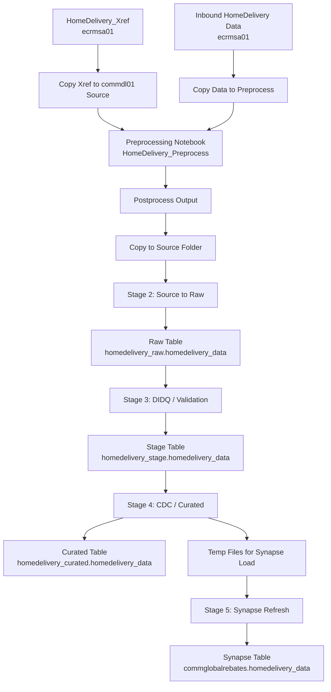

# Home Delivery Data Processing - Code Flow Documentation

## Overview
This document describes the end-to-end Home Delivery data flow from inbound file ingestion through preprocessing, validation, curation, and final Synapse table refresh.

It is designed to provide both:
- **Technical stage-wise details**
- **Graphical flow representation** for easy understanding

---

## Table of Contents
1. [End-to-End Flow Diagram](#end-to-end-flow-diagram)
2. [Pipeline Stages](#pipeline-stages)
3. [Detailed Stage Descriptions](#detailed-stage-descriptions)
4. [Key Validations and Checks](#key-validations-and-checks)
5. [Important Observations](#important-observations)
6. [Data Storage Locations Reference](#data-storage-locations-reference)
7. [Summary](#summary)

---

## End-to-End Flow Diagram

---

## Pipeline Stages

The Home Delivery data processing is divided into **5 main pipeline stages**:

| Stage | Pipeline Code | Purpose |
|-------|---------------|---------|
| 1 | `PL_HOMEDELIVERY_DATA_PREPROCESSING` | Data Preprocessing & Enrichment |
| 2 | `PL_GLOBALREBATES_MASTER_PULL_SRC_RAW` | Source to Raw Layer Migration |
| 3 | `PL_GLOBALREBATES_MASTER_DI_DQ_DC_SRV_SRS` | Data Validation & Transformation |
| 4 | `PL_GLOBALREBATES_MASTER_CDC_CUR` | CDC Processing & Curation |
| 5 | `PL_GLOBALREBATES_MASTER_SYNP_RFR` | Synapse Refresh & Final Load |

---

## Detailed Stage Descriptions

## **STAGE 1: Data Preprocessing** (`PL_HOMEDELIVERY_DATA_PREPROCESSING`)

**Purpose:** Prepare and enrich raw source files before they enter the core pipeline.

### Step 1.1: Copy Cross-Reference File
- **Source:** `https://bpaze1iecrmsa01.dfs.core.windows.net/comm-globalrebates/HomeDelivery_Xref/<filename>`
- **Destination:** `https://bpaze1icommdl01.dfs.core.windows.net/comm-globalrebates/HomeDelivery_Xref/Source/HomeDelivery_Xref_Data/<filename>`
- **Observation:** No filename format restriction is currently defined.
- **Additional Action:** Delete the source file from `ecrmsa01` after successful copy.

### Step 1.2: Copy Home Delivery Data File
- **Source:** `https://bpaze1iecrmsa01.dfs.core.windows.net/comm-globalrebates/HomeDelivery_Data/Inbound/<filename>`
- **Destination:** `https://bpaze1icommdl01.dfs.core.windows.net/comm-globalrebates/Preprocess/HomeDelivery_Data/<filename>`

### Step 1.3: Execute Preprocessing Notebook
- **Notebook path:** `/Workspace/COMM - ElancoCORE-Global Rebates (GRBS)/Services/HomeDelivery_Preprocess`

### Preprocessing Logic
- If the file was already processed previously:
  1. Delete that file’s data from **Raw**, **Stage**, and **Curated** tables
  2. Delete related entries from all **log tables**
- Standardize / correct column headers
- Join with `homedelivery_xref_data`
- Derive `CRM_ID`
- Write processed output to:

`https://bpaze1icommdl01.dfs.core.windows.net/comm-globalrebates/HomeDelivery_Postprocess/HomeDelivery_Data/`

### Step 1.4: Post-Processing Actions
- Delete existing records from Synapse target table:
  - `commglobalrebates.homedelivery_data`
- Copy processed file from Postprocess to Source:
  - **From:** `https://bpaze1icommdl01.dfs.core.windows.net/comm-globalrebates/HomeDelivery_Postprocess/HomeDelivery_Data/`
  - **To:** `https://bpaze1icommdl01.dfs.core.windows.net/comm-globalrebates/HomeDelivery/Source/HomeDelivery_Data`
- Cleanup temporary/exchange locations:
  - Delete files from exchange and preprocess folders

---

## **STAGE 2: Source to Raw Layer** (`PL_GLOBALREBATES_MASTER_PULL_SRC_RAW`)

**Purpose:** Move processed source data into the raw layer and archive source files.

### Step 2.1: Copy from Source to Raw
- **Source:** `https://bpaze1icommdl01.dfs.core.windows.net/comm-globalrebates/HomeDelivery/Source/HomeDelivery_Data`
- **Destination:** `https://bpaze1icommdl01.dfs.core.windows.net/comm-globalrebates/HomeDelivery/Raw/source/homedelivery_data`

### Step 2.2: Archive Source Files
- **Source Folder:** `https://bpaze1icommdl01.dfs.core.windows.net/comm-globalrebates/HomeDelivery/Source/HomeDelivery_Data`
- **Archive Location:** `https://bpaze1icommdl01.dfs.core.windows.net/comm-globalrebates/HomeDelivery/Source/Archive/HomeDelivery_Data`

---

## **STAGE 3: Data Integration, Quality & Validation** (`PL_GLOBALREBATES_MASTER_DI_DQ_DC_SRV_SRS`)

**Purpose:** Validate source structure and apply DIDQ rules before loading into stage.

### Component 3.1: `source2raw_master_package.scala`
**Functions performed:**
- Read input source file
- Validate column names
- Validate column count
- Insert only new records using **EXCEPT** logic
- Write output to raw table:

`homedelivery_raw.homedelivery_data`

### Component 3.2: `raw2stage_master_package.scala`
**Functions performed:**
- Read data from raw table
- Filter records for the current file
- Apply DIDQ validation services:
  - Trim service
  - Datatype service
  - Data quality service
- Write output to stage table:

`homedelivery_stage.homedelivery_data`

---

## **STAGE 4: CDC & Curation** (`PL_GLOBALREBATES_MASTER_CDC_CUR`)

**Purpose:** Prepare curated output and generate Synapse-ready data.

### Component 4.1: `stage2curated2syn_Ecom_master_package.scala`
**Functions performed:**
- Read records from the stage table
- Apply CDC logic if enabled
- Write current file data into curated table:

`homedelivery_curated.homedelivery_data`

- Write current file data to temporary storage for Synapse dedicated pool load
- Delete processed files from:
  - Raw folder
  - Source folder

---

## **STAGE 5: Synapse Refresh** (`PL_GLOBALREBATES_MASTER_SYNP_RFR`)

**Purpose:** Load the latest curated output into Synapse dedicated pool.

### Stored Procedure
- **Procedure:** `[CommGlobalRebates].[usp_RefreshSynapseFromAdls]`
- **Action:** Refresh Synapse dedicated pool table from ADLS temp load location
- **Target Table:** `commglobalrebates.homedelivery_data`

---

## Key Validations and Checks

### **Column and Structural Validations**
- Column name validation
- Column count validation
- Datatype validation

### **Data Quality Services**
- Trim service
- Datatype service
- Data quality service

### **Duplicate Handling**
- EXCEPT clause is used to write only new records
- Reprocessed files are cleaned from Raw, Stage, Curated, and log tables before rerun

---

## Important Observations

### **Datatype Observations**
- As per Home Delivery metadata, all columns are strings except:
  - `sold`
  - `amount`
- Because of this, date columns currently do **not** have datatype integrity enforcement

### **Primary Key Metadata**
- No primary key metadata is defined for Home Delivery data

### **NULL Checks**
- NOT NULL validations are commented out

### **CDC Status**
- CDC indicator is currently not enabled for Home Delivery

---

## Data Storage Locations Reference

| Layer | Location |
|-------|----------|
| **Xref Exchange** | `https://bpaze1iecrmsa01.dfs.core.windows.net/comm-globalrebates/HomeDelivery_Xref/<filename>` |
| **Xref Commdl01 Source** | `https://bpaze1icommdl01.dfs.core.windows.net/comm-globalrebates/HomeDelivery_Xref/Source/HomeDelivery_Xref_Data/<filename>` |
| **Inbound Source Data** | `https://bpaze1iecrmsa01.dfs.core.windows.net/comm-globalrebates/HomeDelivery_Data/Inbound/<filename>` |
| **Preprocess** | `https://bpaze1icommdl01.dfs.core.windows.net/comm-globalrebates/Preprocess/HomeDelivery_Data/<filename>` |
| **Postprocess** | `https://bpaze1icommdl01.dfs.core.windows.net/comm-globalrebates/HomeDelivery_Postprocess/HomeDelivery_Data/` |
| **Source** | `https://bpaze1icommdl01.dfs.core.windows.net/comm-globalrebates/HomeDelivery/Source/HomeDelivery_Data` |
| **Raw** | `https://bpaze1icommdl01.dfs.core.windows.net/comm-globalrebates/HomeDelivery/Raw/source/homedelivery_data` |
| **Archive** | `https://bpaze1icommdl01.dfs.core.windows.net/comm-globalrebates/HomeDelivery/Source/Archive/HomeDelivery_Data` |
| **Synapse Table** | `commglobalrebates.homedelivery_data` |

---

## Summary

The Home Delivery process follows a **5-stage ETL pipeline**:

1. **Preprocess** inbound and xref files
2. **Move** processed files into source and raw layers
3. **Validate** structure and apply DIDQ rules
4. **Curate** and prepare Synapse-ready output
5. **Refresh** Synapse dedicated pool with latest data

This version adds visual documentation so that both technical and business users can quickly understand the complete flow.

---

*Last Updated: 2026-06-12*  
*Document Version: 2.0*
